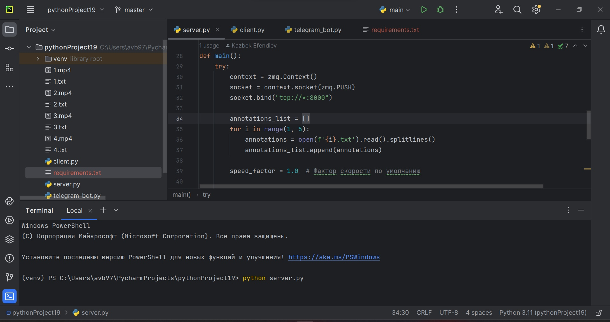

## Задание
Реализовать GUI с синхронным воспроизведением 4х видео. 
Дополнительные задания:
- Добавить регулировку скорости воспроизведения: 0,2х – 1к/с, 1х – 5 к/с, 10х – 50 к/с.
- реализовать клиент серверную архитектуру (сервер синхронизирует видео и отправляет кадры клиенту пачкой из 4 кадров, по одному с каждого видео; клиент читает и отображает кадры).
- добавить на изображение кадра метку, по которой пользователю можно понять, что кадр старый
- реализовать отправку видео в чат-бот (например, в телеграм) по запросу /get_video.

## Инструменты которые использовались при разработке
- Язык Python
- Библиотека ZMQ
- Библиотека Socket
- Библиотека PyQt
- Библиотека cv2
- Библиотека telepot
## Установка

Для начала нужно скачать репозиторий

```bash
git clone https://github.com/Kzefnde/pythonProject19.git
```

Лучше всего чтобы проект запускался в виртуальном окружении.
Для этого в консоль нужно ввести 2 команды
```bash
python -m venv venv
```
```bash
\venv\Scripts\activate
```
Первая команда создаёт виртуальное окружение(если его по какой-то причине нет),вторая команда активирует виртуальное окружение 

Для установки всех необходимых библиотек в проекте есть файл `requirements.txt` который автоматически подтянет все необходимые библиотеки

## Запуск программы

клиент,сервер и функционал телеграм бота работают на `tcp://*:8000` который при желании можно поменять 

Запуск сервера: 
```bash
python server.py
```
Запуск клиента:
```bash
python client.py
```
Запуск телеграм бота:
```bash
python telegram_bot.py
```

## Результат
Запуск сервера:

|  |
|---------------------------------|

Запуск клиента:

|  |
|---------------------------------|

В появившемся окне появится мини плеер с 4 видеопотоками и регулировками скорости 

|  |
|---------------------------------|

Запуск телеграм бота:

|  |
|---------------------------------|

В диалоговом окне бота нужно будет ввести команду `/get_video`,после чего появится меню с выбором видео(видео могу грузится долго т.к видеофайлы весят много).Ссылка на телеграм бот `https://t.me/VideoSynchron_bot`

|  |
|---------------------------------|


